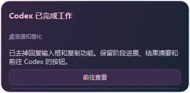
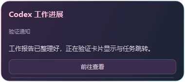

# 爱弥斯 · 像素陪伴 v0.5.1

Windows 像素桌宠，以《鸣潮》爱弥斯为主题，陪伴本机 Codex 工作。无需 Python，平时只有小人，没有常驻按钮、养成负担或每日打卡。


## 下载与启动

从 [Releases](https://github.com/zzChar/aemeath-codex-pet/releases/latest) 下载 `AemeathPet-v0.5.1-Windows-x64.zip`，**完整解压**后双击 `AemeathPet.exe`。需要 Windows 10/11 64 位；保留同目录 `_internal` 文件夹。请不要直接在压缩包内运行。程序没有代码签名。

可以将解压后的文件夹放在自己常用的软件目录。需要开机启动时，按 `Win+R` 输入 `shell:startup`，在打开的文件夹中放置 `AemeathPet.exe` 的快捷方式；以后移动软件目录时也要更新快捷方式。便携包不会自动修改启动项。

升级时退出旧版，将新版完整解压到原程序目录并替换程序文件。`%LOCALAPPDATA%\AemeathPet` 中的个人设置和未查看提醒会保留；若安装路径相同，无需重新设置启动快捷方式。程序目前不自动更新。

## 互动

- **摸头**：左键点击头发、脸或头饰，播放开心反应；按住拖动可调整位置。
- **空闲动画**：约 22–45 秒随机吃蛋糕、睡觉、挥手、小跳、舒展机械翼或四处看看。
- **视线跟随**：鼠标持续移动约 0.2 秒才激活，停下约 0.35 秒恢复正面。打字、隐藏光标或前台全屏时暂停；正常最大化窗口仍可跟随。
- **思考与工作**：根据 Codex 本机任务事件，切换思考动画或工作台动画，下方显示任务状态。
- **额度浮窗**：悬停约 0.45 秒显示 5 小时与每周剩余百分比、重置时间和刷新状态。默认每分钟更新，也可手动刷新。
- **完成提醒**：完成任务后庆祝，卡片显示结果摘录并保留“前往查看”按钮，约每 8 秒重复提示音。点击按钮或摸头会打开对应 Codex 任务；成功切回 Codex 才取消提醒。多个完成结果逐项查看，重启后保留未查看提醒。

右键可以快捷开关功能、打开设置、居中、隐藏或退出。托盘双击也能打开设置。提示音默认 85%，设置支持 0–100% 音量和试听；关闭声音仍保留完成卡片。

## 工作报告通知

- **阶段进展**：摘取 Codex 公开可见的进展消息，最多每 10 秒显示一次，约 14 秒后收起；鼠标悬停在卡片上时暂缓收起。
- **工作结果**：显示最终回复前约 320 字。保留庆祝和重复提示音，点击“前往查看”或摸头打开对应任务；跳转失败会保留提醒。
- **再次查看**：额度浮窗和右键菜单中的“工作报告”可以打开最近报告。设置可分别关闭进展通知或结果内容。

卡片只保留通知内容和跳转按钮；权限审批、问题选择和后续回复在 Codex 中处理。消息直接摘自实际输出，去除 Markdown 链接、代码块和内部记忆引用，不额外调用模型生成摘要。长内容请跳转到任务阅读。




## Codex 连接与隐私

安装并登录 Windows Codex 桌面端后，桌宠自动寻找本机 `codex.exe`，也可在设置中指定位置。额度通过自己的 `codex app-server` 子进程，只读调用 `account/rateLimits/read`。不创建或恢复任务，不发送提示词，不保存账号令牌。

任务状态约每秒观察本机 Codex 的只读 SQLite 元数据及任务记录，解析生命周期、事件类型和调用 ID，并读取公开可见的 assistant commentary / final 消息形成通知。未查看提醒会在本机保存任务/回合 ID、标题和最多约 600 字的最终回复摘录，以便重启后继续提示。不保存完整会话、工具输出、图片或模型思考内容。键盘观察只记录最近活动时间，不读取字符、不保存输入、不拦截按键。

数据在 `%LOCALAPPDATA%\AemeathPet`：设置为 `state.json`，未查看提醒为 `pending-completions.json`。这些个人文件不包含在公开仓库或便携包中。

这不是官方 Codex 或《鸣潮》插件。仅覆盖当前 Windows 设备保存的 Codex 桌面任务，云端和其他设备暂不覆盖。思考/工作由本地事件推断，短步骤、审批等待或后台异步工具可能有延迟；只在明确完成事件后提醒。额度失败时显示错误或上次数据，不估算 token。Codex 本机记录格式变化可能需要适配。

## 从源码运行

需要 Windows、Python 3.12 和 PowerShell。在仓库根目录运行：

```powershell
python -m venv work/venv
& ./work/venv/Scripts/python.exe -m pip install -r requirements-dev.txt
$env:PYTHONPATH = "$PWD/src"
& ./work/venv/Scripts/python.exe launch.py
```

测试：

```powershell
& ./work/venv/Scripts/python.exe -m pytest tests -q
```

打包：

```powershell
./build.ps1 -Python "$PWD/work/venv/Scripts/python.exe"
```

输出在 `dist/AemeathPet`。构建脚本隔离 DLL 搜索路径，使用可替换的动态 Qt 库。Release 同时附带完整项目源码压缩包、依赖许可与 SHA-256 校验值。

## 素材与许可

人物主体及视线来自提供的游戏像素素材；吃饭、睡觉、庆祝、工作台和思考动画由 OpenAI imagegen 参照人物生成，源图和提示词随源码提供。提示音为本项目合成音频。角色与游戏美术权利归原权利人，公开文件不代表获得角色、美术的商业使用或再分发许可。项目未为自身代码另行授予通用开源许可证；第三方依赖按各自许可证使用，详见 [NOTICE.md](NOTICE.md) 和 `licenses/`。

交互灵感参考 [dsh-pet-live2d](https://github.com/A8Chann/dsh-pet-live2d)，本项目使用自己的 Qt 实现，没有复制其代码或鲸鱼娘素材。
